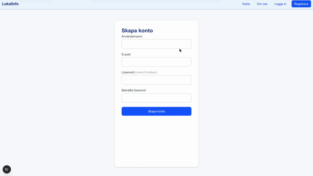
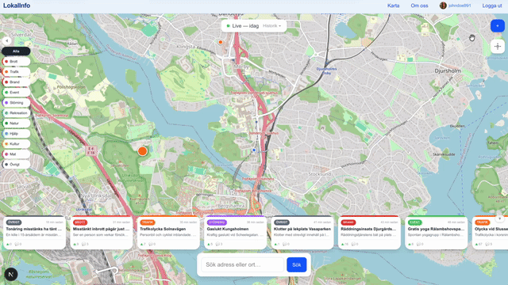
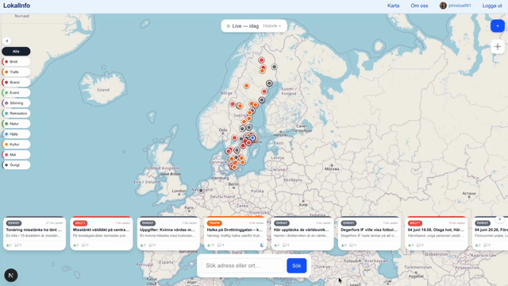
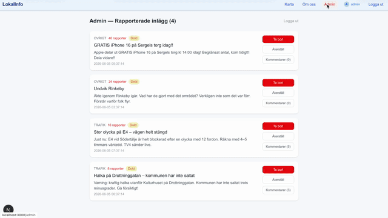

# LokalInfo 🗺️

> Din karta över vad som händer just nu — hyperlokal, realtid, community-driven.

LokalInfo är en interaktiv kartbaserad plattform där människor delar vad som händer i deras närområde. Oavsett om det gäller trafikstörningar, brott, evenemang eller tips — allt visas direkt på kartan där det faktiskt sker.

---

## Resultat

### Registrering & Onboarding


### Skapa inlägg med bild


### Tidslinje & kategorifilter


### Adminpanel & moderering


---

## Funktioner

| Funktion | Beskrivning |
|---|---|
| 📍 Live-karta | Inlägg placerade exakt där de sker, uppdaterade var 30:e sekund |
| 🕐 Historikläge | Res tillbaka upp till 30 dagar och se tidigare händelser |
| 📝 Skapa inlägg | Välj kategori, lägg till bild och beskrivning direkt på kartan |
| 👍 Röstning | Upvotes/downvotes påverkar inläggets storlek och synlighet |
| 💬 Trådade kommentarer | Diskutera och svara direkt under varje inlägg |
| 📲 Senaste nytt-feed | Horisontell feed längst ner — klicka för att flyga till platsen |
| 🔍 Sök & navigera | Sök adress eller plats och hoppa dit direkt |
| 🚨 Rapportera | Community-driven moderering via rapportfunktion |
| 🤖 Externa datakällor | Automatisk synk från Polisen, SVT Nyheter, GDELT och Krisinformation |

---

## Tech Stack

**Backend** — Python 3.12, FastAPI, SQLModel, PostgreSQL, asyncpg, Alembic  
**Frontend** — Next.js 15, React 19, TypeScript, Tailwind CSS 4, Leaflet  
**Auth** — NextAuth v5 (sessioner) + JWT (admin-API)  
**Infra** — Docker Compose (dev + prod), Uvicorn, IMGBB (bilduppladdning)

---

## Kom igång (för utvecklare)

### Krav

- [Docker](https://www.docker.com/) + Docker Compose
- [Node.js 20+](https://nodejs.org/) (om du kör frontend utan Docker)
- [Python 3.12+](https://www.python.org/) (om du kör backend utan Docker)

---

### Snabbstart med Docker (rekommenderat)

**1. Klona repot**
```bash
git clone https://github.com/<ditt-användarnamn>/lokalinfo.git
cd lokalinfo
```

**2. Skapa miljövariabler**

Skapa en `.env`-fil i rotkatalogen:

```env
# Databas
POSTGRES_DB=lokalinfo
POSTGRES_USER=user
POSTGRES_PASSWORD=password
DATABASE_URL=postgresql+asyncpg://user:password@db:5432/lokalinfo

# Backend
ADMIN_TOKEN=byt-ut-detta-till-en-hemlig-token
CORS_ORIGINS=http://localhost:3000
DEBUG=true

# Frontend
NEXT_PUBLIC_API_URL=http://localhost:8000
BACKEND_URL=http://backend:8000
AUTH_SECRET=<generera med: openssl rand -base64 32>
AUTH_URL=http://localhost:3000
IMGBB_API_KEY=<din-imgbb-api-nyckel>

# Externa API:er (valfritt — appen fungerar utan dessa)
TRAFIKVERKET_API_KEY=
JWT_SECRET=<generera med: openssl rand -base64 32>
```

> **IMGBB API-nyckel** — gratis på [imgbb.com](https://imgbb.com/) och krävs för bilduppladdning.

**3. Starta dev-miljön**
```bash
docker compose -f docker-compose.dev.yml up --build
```

Tjänsterna startar automatiskt:

| Tjänst | URL |
|---|---|
| Frontend | http://localhost:3000 |
| Backend API | http://localhost:8000 |
| API-dokumentation | http://localhost:8000/docs |
| PostgreSQL | localhost:5432 |

Databasen sätts upp automatiskt vid första uppstarten — inga manuella migreringar behövs.

**Standardinloggning (admin)**
```
E-post:   admin@lokalinfo.se
Lösenord: admin123
```

---

### Lokal utveckling utan Docker

**Backend**
```bash
cd backend
python -m venv venv
source venv/bin/activate        # Windows: venv\Scripts\activate
pip install -r requirements.txt
fastapi dev app/main.py --host 0.0.0.0 --port 8000
```

**Frontend** (i en annan terminal)
```bash
cd frontend
npm install
npm run dev
```

Se till att PostgreSQL körs lokalt och att `DATABASE_URL` i `.env` pekar rätt.

---

### Produktion

```bash
docker compose up --build
```

Använder optimerade Docker-images utan hot reload.

---

## Projektstruktur

```
lokalinfo/
├── backend/
│   └── app/
│       ├── main.py          # FastAPI-app + startup
│       ├── models.py        # Databas-modeller (SQLModel)
│       ├── config.py        # Miljövariabler
│       └── routers/         # posts, comments, auth, admin, users
├── frontend/
│   └── src/
│       ├── app/             # Next.js app-router (sidor + API-routes)
│       └── components/      # React-komponenter
├── docs/                    # GIF-showcase
├── docker-compose.dev.yml   # Dev-miljö
├── docker-compose.yml       # Produktion
└── .env                     # Miljövariabler (skapa lokalt, committa ej)
```

---

## Licens

MIT
